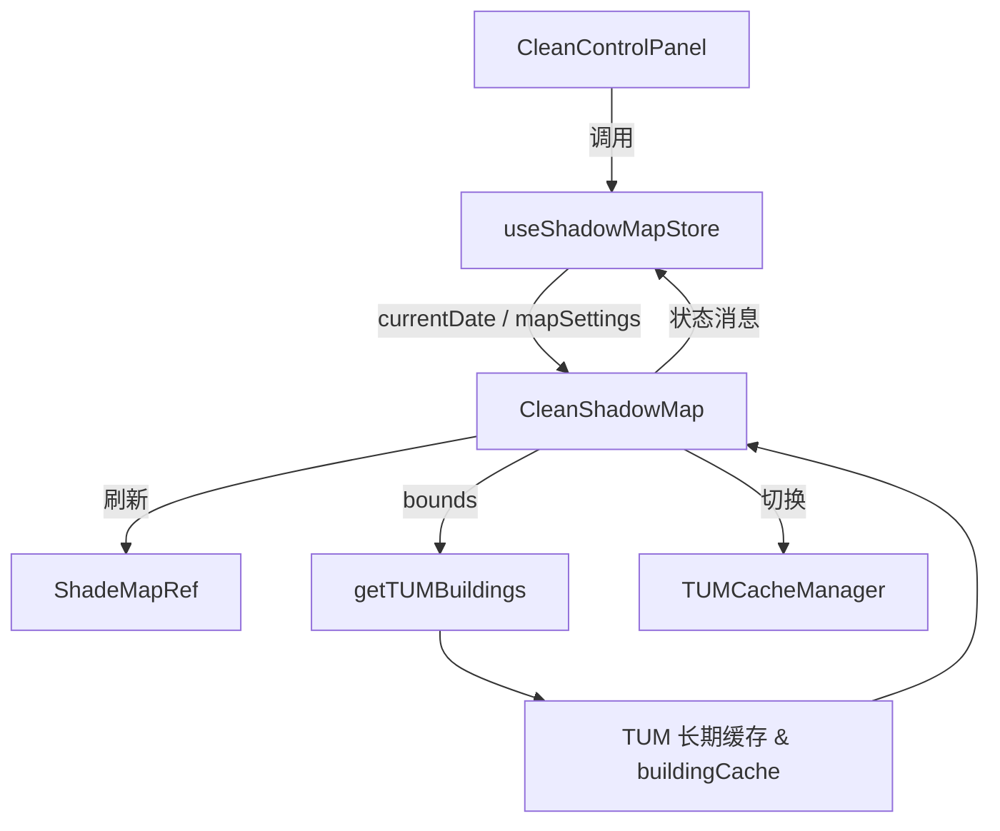

## Clean 3D 模式控制面板概览

> 目标：为后续迭代提供一份结构清晰的开发参考，聚焦 `CleanShadowMap` 及其配套控制面板。

### 1. 模式背景与整体结构
- **入口**：`src/App.tsx` 默认以 `mapMode === 'clean'` 渲染 `CleanShadowMap`，并挂载 `CleanControlPanel` 与 `TUMCacheManager`。
- **核心组件**
  - `CleanShadowMap.tsx`：负责 Mapbox GL 实例、ShadeMap 阴影模拟器、TUM 建筑数据加载与缓存联动。
  - `CleanControlPanel.tsx`：聚合时间、阴影、底图三个子面板，提供业务上最常用的调节项。
  - `TUMCacheManager.tsx`：用于观测/操作长期缓存（长周期 TUM 数据），仅在 Clean 3D 模式下弹出。
- **状态管理**：依赖 `useShadowMapStore`（Zustand）同步时间、图层开关、缓存提示等信息，与 `useShadowMap` 钩子共享阴影模拟器引用。

### 2. 控制面板结构拆解

| 子面板 | 位置 | 主要交互 | 对应逻辑 |
| --- | --- | --- | --- |
| `TimeControlPanel` | 顶部 | 日期时间选择、播放控制、固定时刻（昼夜）按钮 | 调用 `setCurrentDate`，触发 `ShadeMap.setDate` 与太阳位置更新 |
| `ShadowControlPanel` | 中部 | 阴影透明度/颜色调节、图层开关 | 通过 `updateMapSettings` 影响 `mapSettings`，Leaflet/Mapbox/ ShadeMap 同步响应 |
| `MapStylePanel` | 底部 | 底图分类浏览、底图切换、Mapbox Key 输入 | 调用 `baseMapManager.switchBaseMap`，当前未完全接入 Mapbox 实例 |
| 其他 UI | 面板容器外 | 根据 `mapSettings.showCacheStats` 显示缓存信息、按钮触发展开 `TUMCacheManager` | `CleanShadowMap` 内部的 `updateCacheStats`、`setShowCacheManager` 等逻辑 |

### 3. CleanShadowMap 关键流程

1. **地图初始化**
   - `mapboxgl.Map` 在 `useEffect` 首次渲染时创建，中心点默认北京天安门，开启 `hash`、`antialias`。
   - `loadShadowSimulator` 动态加载 ShadeMap UMD；成功后调用 `initShadeMap`。
2. **阴影模拟器**
   - 通过 `window.ShadeMap` 初始化，配置项包含 `terrainSource`（指向 `http://localhost:3001/api/dem/{z}/{x}/{y}.png`）、`getFeatures`（异步获取当前视野建筑）。
   - 阴影参数读取自 `mapSettings`，支持透明度、颜色、曝光热力图。
   - `shadowOptimizer`、`buildingCache` 协助防抖和结果缓存。
3. **建筑数据加载**
   - `loadBuildings()` 内部调用 `getTUMBuildings(bounds)`，支持最大数目限制与流式处理。
   - 结果 `FeatureCollection` 加入 `buildingCache`，并通过 `addBuildingsToMap` 渲染 3D extrusion。
   - 缓存命中时减少网络请求；失败时展示相应 `statusMessage`。
4. **地图事件联动**
   - `moveend` / `zoomend`：延迟触发 `loadBuildings`，并更新 `useShadowMapStore.setMapView`。
   - 自动加载开关 `autoLoadBuildings` 可供 UI 控制；默认开启。
5. **缓存与诊断**
   - `buildingCache`：短期缓存当前 session 数据。
   - `TUMCacheManager`：通过 `http://localhost:3001/api/tum-cache/*` API 读取长期缓存统计、发起预加载、清理过期数据。
   - 面板状态 `showCacheManager` 由 Clean 控件切换；内部提供热门城市批量预加载等功能。

### 4. 状态与数据流

- **日期变更**：`TimeControlPanel` → `setCurrentDate` → `useShadowMap` 监听 → `ShadeMap.setDate` + `updateSunPosition`。
- **图层开关**：`ShadowControlPanel` → `updateMapSettings` → `CleanShadowMap` 通过 `mapSettings` 响应（添加/移除建筑层、更新阴影透明度）。
- **网络请求**：`getTUMBuildings` 优先读长期缓存，若 miss 则由后端拉取并更新缓存。

### 5. 当前限制与注意事项
- `MapStylePanel` 对 Mapbox 底图切换仍是 TODO，需要与 `mapRef` 联动。
- `TUMCacheManager` 依赖后端服务运行在 `localhost:3001`，在本地未启动时需对 UI 进行降级提示。
- 阴影模拟器脚本来源于 CDN，离线环境需本地托管或增加失败重试。
- 建筑加载在高 zoom 时仍可能拥塞：`autoLoadBuildings` 配合 `shadowOptimizer` 进行节流，但需关注 move/zoom 频繁触发时的体验。

### 6. 后续迭代建议
1. **控制面板统一化**：整合 `SimpleControlPanel` 与 Clean 模式控件，减少重复逻辑，统一视觉样式。
2. **底图切换完备**：让 `MapStylePanel` 实际调用 `mapRef.current.setStyle` 或预配置的 Mapbox 样式，并保留 API Key 校验反馈。
3. **缓存可视化**：在 Clean 控件中增加缓存命中率、预加载进度展示，与 `advancedCacheManager` 数据打通。
4. **调试模式**：提供“开发者模式”开关，快速打开日志面板、打印当前缓存/阴影配置，便于定位问题。
5. **异常兜底**：为 `ShadeMap` 初始化、TUM 请求等关键路径增加 UI 层的 retry/placeholder，避免单点失败导致空白屏幕。

---

如需进一步拆解，请结合 `src/components/Map/CleanShadowMap.tsx`、`src/components/UI/CleanControlPanel.tsx`、`src/services/tumBuildingService.ts` 的源码注释。此文档可作为新增交互或性能优化的起点。
